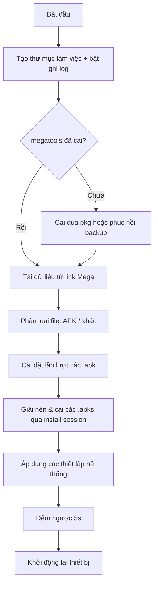

<div align="center">

# 🐧 setup-droid

**Script tự động thiết lập máy Android (ảo/root) chỉ với một dòng lệnh**


</div>

---

## 📋 Mục lục

- [Giới thiệu](#-giới-thiệu)
- [Tính năng](#-tính-năng)
- [Yêu cầu hệ thống](#-yêu-cầu-hệ-thống)
- [Cài đặt](#-cài-đặt)
- [Luồng hoạt động tổng quát](#-luồng-hoạt-động-tổng-quát)
- [Các thiết lập hệ thống được áp dụng](#%EF%B8%8F-các-thiết-lập-hệ-thống-được-áp-dụng)
- [Cấu trúc thư mục sau khi chạy](#-cấu-trúc-thư-mục-sau-khi-chạy)
- [Lưu ý & Cảnh báo](#️-lưu-ý--cảnh-báo)

---

## 📖 Giới thiệu

**setup-droid** là một script Bash chạy trong **Termux** trên thiết bị Android đám mây hay Android ảo đã **root**, giúp tự động hóa toàn bộ quy trình thiết lập ban đầu: cài đặt công cụ cần thiết, tải và cài các ứng dụng APK từ kho lưu trữ Mega, đồng thời cấu hình sẵn các tùy chọn hệ thống thường dùng.


## ✨ Tính năng

- ⚙️ **Tự động cài `megatools`** — hỏi người dùng chọn cài qua `pkg` hoặc phục hồi từ file backup có sẵn trên GitHub Releases.
- ☁️ **Tải file từ Mega** theo link được cấu hình sẵn trong script. (Xem link file mega cụ thể ở [Lưu ý & Cảnh báo](#️-lưu-ý--cảnh-báo))
- 🗂️ **Tự phân loại file** đã tải: `.apk` / `.apks` vào một thư mục, các file còn lại vào thư mục khác.
- 📦 **Tự động cài đặt APK**:
  - File `.apk` thường → cài trực tiếp qua `pm install`.
  - File `.apks` (split APK) → tự giải nén và cài bằng install session (`pm install-create` / `install-write` / `install-commit`).
- 🛠️ **Tự động cấu hình hệ thống** sau khi cài đặt (xem chi tiết bên dưới).
- 🔁 **Tự khởi động lại thiết bị** (soft reboot qua `killall system_server`) sau khi hoàn tất.
- 📝 **Ghi log đầy đủ** toàn bộ quá trình vào file `program.log` để dễ dàng kiểm tra/debug.

## 🧰 Yêu cầu hệ thống

| Thành phần | Yêu cầu |
|---|---|
| Thiết bị | Android đã root (vật lý hoặc máy ảo/emulator) |
| Môi trường | [Termux](https://termux.dev) |
| Quyền | Truy cập `su` (Magisk hoặc tương đương) |
| Mạng | Bắt buộc kết nối Internet (để tải từ Mega và GitHub) |

## 🚀 Cài đặt

Mở Termux và chạy lệnh sau:

```bash
source <(curl -sL https://raw.githubusercontent.com/vxah-ka/setup-droid/refs/heads/0/scripts/main.sh | tr -d '\r')
```

[Link rút gọn](https://bit.ly/m/dgz) để sao chép câu lệnh cài đặt nhanh hơn~

## 🔄 Luồng hoạt động tổng quát



## ⚙️ Các thiết lập hệ thống được áp dụng

Sau khi cài xong ứng dụng, script sẽ tự động cấu hình:

| Hạng mục | Giá trị được đặt |
|---|---|
| Múi giờ | `Asia/Ho_Chi_Minh` (tắt tự động dò múi giờ) |
| Tùy chọn nhà phát triển | Bật (`development_settings_enabled`) |
| Hiệu ứng chuyển động (animation) | Tắt hoàn toàn (window/transition/animator = 0) |
| Show touches | Bật (hiển thị điểm chạm trên màn hình) |
| Mật độ điểm ảnh (DPI) | Đặt qua `wm density 221` |
| Launcher mặc định | Đặt về gói `amirz.rootless.nexuslauncher` |
| Trình duyệt mặc định | Firefox (`org.mozilla.firefox`) |
| Ngôn ngữ hệ thống | Tiếng Việt (`vi-VN`) |
| Giao diện | Dark mode (`ui_night_mode = 2`) |

## 📁 Cấu trúc thư mục sau khi chạy

```
/sdcard/Download/AutoDroid/
├── apk/            # Các file .apk / .apks đã tải
├── other/          # Các file không phải APK
└── program.log     # Nhật ký toàn bộ quá trình chạy
```

## ⚠️ Lưu ý & Cảnh báo

- Script yêu cầu quyền **root** và sẽ thực thi nhiều lệnh `su` — chỉ chạy trên thiết bị/máy ảo mà bạn tin tưởng và kiểm soát hoàn toàn.
- Script sẽ **tự động thay đổi nhiều thiết lập hệ thống** — hãy chắc chắn đây là điều bạn mong muốn trước khi chạy.
- Thiết bị sẽ **tự khởi động lại (soft reboot)** khi script hoàn tất — hãy lưu công việc đang dở trước khi chạy.
- Nội dung APK được tải về phụ thuộc vào [link Mega](https://mega.nz/folder/L7YSVQBK#iaLQ1dNjyTDp8YCW3Tr72Q) đã cấu hình sẵn trong script

<div align="center">

Made with 🐧 — *Provided by Khoaa and A.I*

</div>
